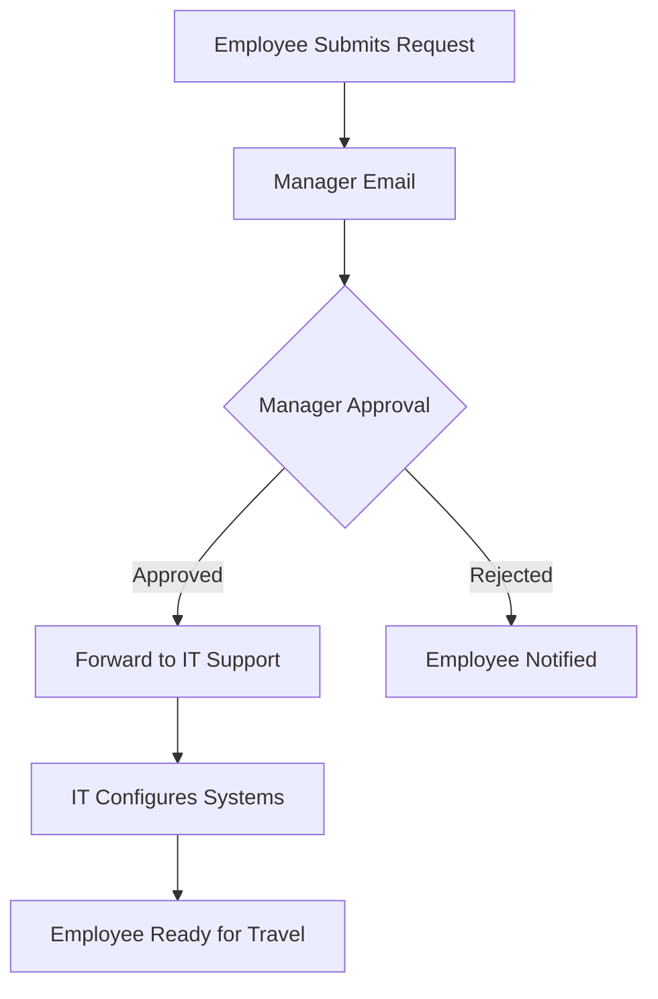

# Greenwin TravelPack Portal

A modern, professional web application for managing international travel approval requests and IT system access coordination.


## 🌟 Overview

The TravelPack Portal streamlines the international travel approval process for Greenwin Corp employees, ensuring proper IT security configuration and manager approval before travel. This solution eliminates manual coordination overhead while maintaining robust security standards.

## ✨ Features

### 🔐 Approval Workflow
- **Manager-First Routing**: Requests route to direct manager for business approval
- **IT Integration**: Automatic forwarding to IT Support after manager approval
- **Email Automation**: Pre-formatted emails with structured data tables

### 📋 Comprehensive Data Collection
- Employee information and contact details
- Travel dates, duration, and destination
- Business purpose and system requirements
- Company device inventory
- Compliance acknowledgments

### 🎨 Modern Design
- Professional Greenwin Corp branding
- Responsive design for all devices
- Glassmorphism effects and smooth animations
- Intuitive form validation
- Professional checkbox system

### ⚡ Smart Features
- Automatic travel duration calculation
- 48-hour advance notice enforcement
- Real-time form validation
- Email format verification
- Required field enforcement

## 🚀 Getting Started

### Prerequisites
- Modern web browser (Chrome, Firefox, Safari, Edge)
- Email client configured on the device

### Installation

1. **Clone the repository**
   ```bash
   git clone https://github.com/[your-username]/greenwin-travelpack.git
   cd greenwin-travelpack
   ```

2. **Open the portal**
   ```bash
   open index.html
   ```
   Or simply double-click `index.html` in your file explorer.

### Usage

1. **Fill out the form** with your travel details
2. **Submit for approval** - email opens to your manager
3. **Manager reviews and forwards** to IT Support
4. **IT configures systems** for your travel destination
5. **Travel with confidence** knowing your systems are configured

## 📁 Project Structure

```
TravelPack/
├── index.html              # Main application file
├── project_summary.md      # Project documentation
└── README.md              # This file
```

## 🛠️ Technical Details

### Technologies Used
- **HTML5**: Semantic structure and accessibility
- **CSS3**: Advanced styling with gradients and animations
- **JavaScript**: Form handling, validation, and email generation
- **Font Awesome**: Professional iconography
- **Google Fonts**: Typography (Inter, JetBrains Mono)

### Key Features
- **Responsive Design**: Works seamlessly across all devices
- **Client-Side Validation**: Immediate feedback for user inputs
- **Email Integration**: Automated mailto: protocol with structured content
- **Progressive Enhancement**: Graceful degradation for older browsers
- **Performance Optimized**: Fast loading with minimal dependencies

## 🔄 Workflow Architecture



## 📧 Email Integration

The portal generates structured emails containing:

- **Employee Details**: Contact and department information
- **Travel Information**: Dates, destination, duration, purpose
- **Device Inventory**: Company equipment being transported
- **IT Actions Required**: Specific technical requirements
- **Instructions**: Clear next steps for managers

## 🔒 Security & Compliance

- **Data Protection**: All information handled securely through email protocols
- **Access Control**: Manager approval required before IT involvement
- **Device Tracking**: Complete inventory of company assets
- **Policy Acknowledgment**: Required compliance confirmations
- **Audit Trail**: Email documentation for all requests

## 📱 Browser Compatibility

| Browser | Version | Support |
|---------|---------|---------|
| Chrome  | 90+     | ✅ Full |
| Firefox | 88+     | ✅ Full |
| Safari  | 14+     | ✅ Full |
| Edge    | 90+     | ✅ Full |

## 🎯 Business Impact

### Process Improvement
- Eliminated manual coordination between departments
- Standardized data collection for IT planning
- Reduced processing time through automated routing
- Improved compliance with mandatory acknowledgments

### IT Security Enhancement
- Proactive planning with 48-hour advance notice
- Complete device tracking for traveling equipment
- Structured approach to Microsoft Exchange conditional access
- Comprehensive audit trail for compliance

## 🚀 Deployment

### Production Deployment
1. Host `index.html` on your web server
2. Ensure HTTPS for security
3. Configure email client integration
4. Train users on the new process

### Customization
- Update company branding in CSS variables
- Modify email templates in JavaScript
- Add additional form fields as needed
- Integrate with existing systems via APIs

## 📈 Future Enhancements

- [ ] Integration with HR systems
- [ ] Dashboard for IT Support
- [ ] Mobile app version
- [ ] Advanced reporting and analytics
- [ ] Multi-language support

## 🤝 Contributing

1. Fork the repository
2. Create a feature branch (`git checkout -b feature/amazing-feature`)
3. Commit your changes (`git commit -m 'Add amazing feature'`)
4. Push to the branch (`git push origin feature/amazing-feature`)
5. Open a Pull Request

## 📄 License

This project is proprietary to Greenwin Corp. All rights reserved.

## 📞 Support

For technical support or questions:
- **Email**: ITSupport@greenwin.ca
- **Internal**: Contact the development team

## 🏆 Acknowledgments

- Greenwin Corp IT Department
- UX/UI Design inspiration from modern web standards
- Font Awesome for iconography
- Google Fonts for typography

---

**Built with ❤️ for Greenwin Corp** 